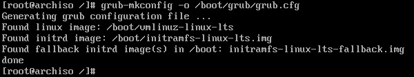

# Gestor de arranque

De todos los gestores de arranque que hay, GRUB sigue siendo el que más compatibilidad ofrece y con el que más usuarios están familiarizados por su veteranía, por lo que se van a explicar los pasos para configurar el arranque del sistema EFI para él.

El primer paso es instalar los paquetes necesarios:

```bash
pacman -S grub efibootmgr dosfstools mtools --noconfirm
```

Con el paquete `grub` se instala su fichero de configuración correspondiente en `/etc/default/grub`. Es necesario editarlo para indicarle que la partición donde se ha instalado el sistema (en este caso, `/dev/sda4`) está encriptada y usa LVM.

```bash
nano /etc/default/grub
```

A la propiedad `GRUB_CMDLINE_LINUX_DEFAULT` hay que añadirle la partición encriptada, teniendo en cuenta que también está dentro de un volumen lógico. En este caso es `/dev/sda4:vg0`, por lo que la línea completa (incluyendo lo que hay por defecto) es:

```bash
GRUB_CMDLINE_LINUX_DEFAULT="loglevel=3 cryptdevice=/dev/sda4:vg0:allow-discards quiet"
```

Además, hay que indicarle que la encriptación es con formato LUKS descomentando la línea

```bash
GRUB_ENABLE_CRYPTDISK=y
```

En este punto es necesario montar la partición `/dev/sda1`, que en la tabla de la sección de [particionado](../install/particionado.md) está indicado que va a contener los archivos necesarios para arrancar el sistema en modo EFI. Al tratarse de una partición con información requerida para arrancar el sistema, hay que montarla en una carpeta dentro de `/boot`, que a su vez es la carpeta donde se ha montado la partición `/dev/sda2`.

```bash
mkdir /boot/EFI
mount /dev/sda1 /boot/EFI
```

Finalmente, instalamos el gestor de arranque con el comando `grub-install`:

```bash
grub-install --target=x86_64-efi --bootloader-id=grub_uefi --recheck
```

Antes de generar el menú que GRUB mostrará al iniciar el sistema, es necesario copiar un archivo para que lo muestre correctamente en inglés:

```bash
cp /boot/grub/locale/en\@quot.mo /boot/grub/en.mo
```

Por último, se genera el menú:

```bash
grub-mkconfig -o /boot/grub/grub.cfg
```

El resultado de este comando indicará que ha "encontrado" tres imágenes por cada kernel que se haya instalado: *linux*, *initrd* y *fallback initrd*.


