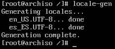

# Idioma

Usando el editor nano, modificar el archivo `/etc/locale.gen` y descomentar las líneas `en_US.UTF-8 UTF-8` y `es_ES.UTF-8 UTF-8` para poder usar el sistema tanto en castellano como en inglés. Aplicar los cambios con el comando `locale-gen`.



Configurar la variable `LANG` en el fichero `/etc/locale.conf` en el idioma que se prefiera de los que se han configurado (`en_US.UTF-8` en este caso):

```bash
echo "LANG=en_US.UTF-8" > /etc/locale.conf
```

Por último, configurar la distribución definiendo la variable `KEYMAP` en el fichero `/etc/vconsole.conf`:

```bash
echo "KEYMAP=es" > /etc/vconsole.conf
```

