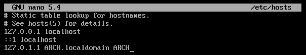

# Red

Aunque en este punto el sistema sea capaz de conectarse a Internet y descargar paquetes, es necesario instalar el software necesario para que una vez eliminado el USB de instalación, se siga teniendo conectividad.

```bash
pacman -S networkmanager wpa_supplicant wireless_tools netctl iwd dhcpcd --noconfirm
```

El paquete `networkmanager` instala un servicio llamado `NetworkManager` para `systemd` que debe ser activado para que pueda gestionar la configuración de las interfaces de red, como asignar IPs o conectar a redes inalámbricas.

```bash
systemctl enable NetworkManager
```

Por último, hay que indicar el *hostname* editando el fichero `/etc/hostname`. En este caso, lo vamos a llamar ARCH:

```bash
echo ARCH > /etc/hostname
```

El archivo `/etc/hosts` también ha de ser modificado.


