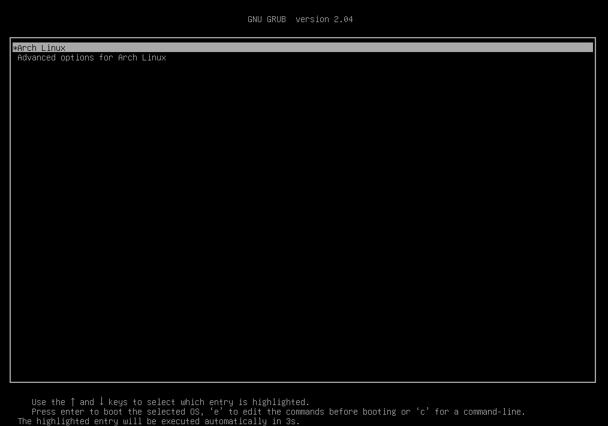
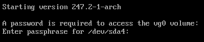
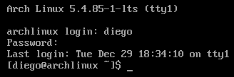

# Probar el sistema

En este punto, si todo se ha hecho correctamente, el sistema debe arrancar sin problema. Primero se ha de salir del entorno de `chroot` en el que se ha estado trabajando:

```bash
exit
```

A continuación, se apaga el sistema:

```bash
poweroff
```

Con el sistema desconectado, se elimina el USB de instalación. Tras arrancar de nuevo, aparecerá el menú de GRUB.



Tras seleccionar la opción por defecto es necesario introducir la clave de cifrado de la partición *Sistema*, en este caso `/dev/sda4`.



Por último, hay que iniciar sesión con el usuario creado previamente, *diego* en este caso.


