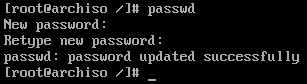
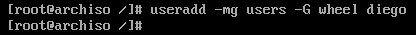
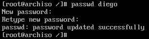
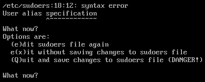

# Usuarios y contraseñas

## Inicializar contraseña de root

Antes de iniciar el sistema por primera vez tras instalar los paquetes, es recomendable configurar la contraseña del usuario `root` con el comando `passwd`.



## Crear usuario

Crear un usuario sin permisos de administrador para el uso habitual del sistema también es lo recomendable. Este usuario pertenecerá a los grupos `users` y `wheel`, este último permitirá ejecutar comandos de `root` usando `sudo`.



>En este caso, el usuario creado se llama *diego* y se le ha creado una carpeta en `/home/diego` a la que solo pueden acceder él y `root`.

Al igual que con `root`, hay que definir la contraseña para el usuario recién creado:



## Permitir ejecutar comandos de root con sudo

El comando `visudo` abre un editor de texto, configurable mediante la variable de entorno `$EDITOR`, para modificar el fichero `/etc/sudoers` de una forma segura (por ejemplo, no permite guardar cambios que vayan a provocar que el parseo del archivo falle). Ese archivo define, entre otras cosas, qué comandos pueden o no ejecutar los usuarios que no son `root` y si ha de solicitarles alguna contraseña previamente.

En este caso, se va a modificar para que los usuarios que pertenezcan al grupo `wheel` puedan lanzar cualquier comando como si fueran `root` (usando `sudo`).

```bash
EDITOR=nano visudo
```

Para que no se pida contraseña a los usuarios, hay que descomentar (eliminar el carácter `#`) la línea

```bash
# %wheel ALL=(ALL) NOPASSWD: ALL
```

Para que se les pida contraseña, la línea a descomentar es

```bash
# %wheel ALL=(ALL) ALL
```

Para guardar los cambios en el editor, hay que pulsar `Ctrl + O` y para salir, `Ctrl + X`. En caso de haber cometido algún error que haya dejado el fichero en un estado inestable, se muestra un aviso dando la opción de volver a abrir el editor o de descartar los cambios.


