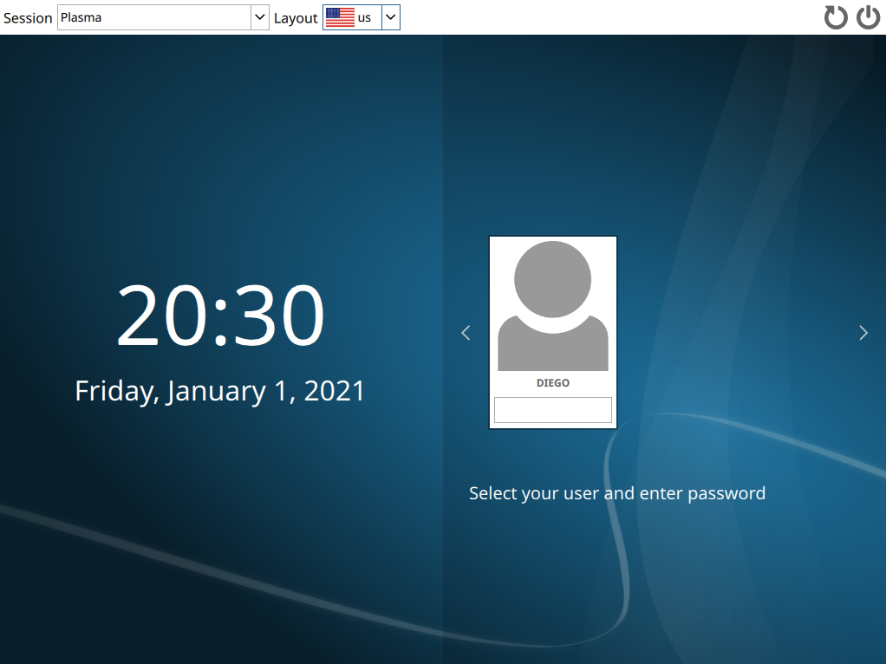

# Gestor de inicio

El paquete `sddm` es el gestor de inicio recomendado si se trabaja con KDE.

```bash
pacman -S sddm sddm-kcm kwallet-pam --noconfirm
```

SDDM necesita activar un servicio de `systemd` para iniciar automáticamente al arranque:

```bash
systemctl enable sddm
```

Es necesario reiniciar para aplicar todos los cambios:

```bash
reboot
```

SDDM se cargará y mostrará una ventana gráfica para introducir un usuario y una contraseña.


