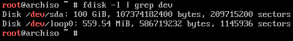
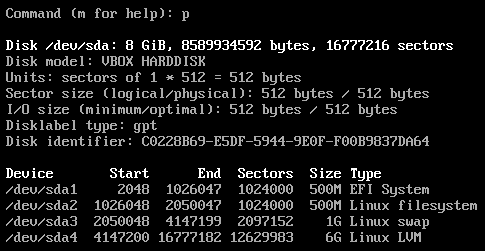
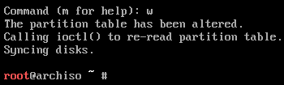

# Particionar disco

Como se ha explicado anteriormente, se va usar LVM para evitar crear particiones fijas de tamaños predefinidos. En vez de eso, simplemente es necesario crear tres: el gestor de arranque, la memoria swap y la que contendrá el resto del sistema y cuentas de usuario (esta última cifrada).

El primer paso consiste en averiguar el identificador que se ha asignado al disco duro sobre el que se va a realizar la instalación mediante:

```bash
fdisk -l | grep dev
```

En este caso solo se dispone de un disco duro al que se le ha asignado el identificador **sda**:



>Es importante realizar los cambios sobre el disco correcto en el que se quiere hacer la instalación porque el proceso de particionado elimina todo el contenido previo que hubiera en él.

El comando `fdisk` también permite gestionar particiones si se le pasa como parámetro un identificador de disco válido:

```bash
fdisk /dev/sda
```

Una vez dentro, los comandos a ejecutar para crear las particiones son:

1. `g` crea una nueva tabla de particiones de tipo GPT.
2. `n` inicia el asistente para crear una nueva partición.
    1. Pulsar Intro para seleccionar por defecto el número de la partición.
    2. Pulsar Intro para seleccionar el valor por defecto del sector de inicio (First sector).
    3. `+500M` indica el tamaño de la partición (500 MiB en este caso) para que `fdisk` calcule el último sector.
    4. `t` para seleccionar el tipo de partición.
    5. `1` para seleccionar el tipo **EFI System**.
3. `n` inicia el asistente para crear una segunda partición (`/boot`).
    1. Pulsar Intro para seleccionar por defecto el número de la partición.
    2. Pulsar Intro para seleccionar el valor por defecto del sector de inicio (First sector).
    3. `+500M` indica el tamaño de la partición (500 MiB en este caso) para que `fdisk` calcule el último sector.
4. `n` inicia el asistente para crear una tercera partición (swap).
    1. Pulsar Intro para seleccionar por defecto el número de la partición.
    2. Pulsar Intro para seleccionar el valor por defecto del sector de inicio (First sector).
    3. En este caso hay que indicar un tamaño equivalente al de la memoria RAM del ordenador. Por ejemplo, para 8 GiB hay que poner `+8G`.
    4. `t` para seleccionar el tipo de partición.
    5. `3` para seleccionar la partición.
    6. `19` para seleccionar el tipo **Linux swap**.
5. `n` inicia el asistente para crear una tercera partición (`/`).
    1. Pulsar Intro para seleccionar por defecto el número de la partición.
    2. Pulsar Intro para seleccionar el valor por defecto del sector de inicio (First sector).
    3. Pulsar Intro para seleccionar el espacio restante del disco.
    4. `t` para seleccionar el tipo de partición.
    5. `4` para seleccionar la partición.
    6. `30` para seleccionar el tipo **Linux LVM**.

Tras realizar estos pasos las particiones habrán sido correctamente creadas, aunque los cambios no son efectivos hasta que no se le indica a `fdisk` que los aplique, por lo que es posible comprobar que todo es correcto antes. La opción `p` muestra un resumen de los cambios realizados hasta el momento:



Finalmente se aplican los cambios con `w` y se cierra el asistente:


