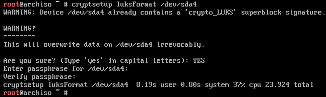
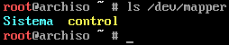
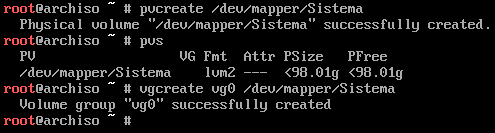

# Formatear y encriptar particiones

Para evitar confusiones con los números de las particiones, se puede usar una tabla para consultar el nombre del dispositivo antes de realizar cualquier operación no reversible. Por eso, a partir de ahora se usará el id en vez del identificador del dispositivo.

Id | Dispositivo | Tipo | Formato | Encriptada | Puntos de montaje
---|---|---|---|---|---
EFI | /dev/sda1 | EFI | FAT 32 | No |
Arranque | /dev/sda2 | Linux | Ext 4 | No | /boot
Swap | /dev/sda3  | Swap | | No
Sistema | /dev/sda4 | LVM | Ext 4 | Sí | /home, /

Formatear la partición *EFI* como FAT 32:

```bash
mkfs.fat -F32 /dev/sda1
```

Formatear la partición *Arranque* como Ext 4:

```bash
mkfs.ext4 /dev/sda2
```

Inicializar y activar la partición *Swap*:

```bash
mkswap /dev/sda3
swapon /dev/sda3
```

Antes de crear las particiones lógicas en *Sistema* hay que activar la encriptación:

```bash
cryptsetup luksFormat /dev/sda4
```

En este punto el sistema solicitará la contraseña a usar para desencriptar el disco y será la que habrá que introducir cada vez que se arranque el ordenador:



Para crear los volúmenes lógicos es necesario por lo tanto desencriptar la partición:

```bash
cryptsetup open --type luks /dev/sda4 Sistema
```

Este crea un fichero que hace referencia a la partición desencriptada:



>*Sistema* es el nombre con el que se va a hacer referencia a la partición mientras haya sido desencriptada con el comando anterior. No es un nombre permanente.

Primero hay que crear un volúmen físico y un *volume group* que lo contenga:

```bash
pvcreate /dev/mapper/Sistema
vgcreate vg0 /dev/mapper/Sistema
```



Por último, hay que crear los volúmenes lógicos a partir del *volume group*:

```bash
lvcreate -L 20G vg0 -n system
lvcreate -l 100%FREE vg0 -n home
```

>Hemos usado 20 GiB para la partición del sistema, lo recomendado, porque asumimos una capacidad de 100 GiB y el resto será para los datos de los usuarios.

Los volúmenes creados como *home* y *system* tendrán montadas las rutas `/home` y `/`. Solo queda formatearlos como Ext 4:

```bash
mkfs.ext4 /dev/vg0/home
mkfs.ext4 /dev/vg0/system
```
