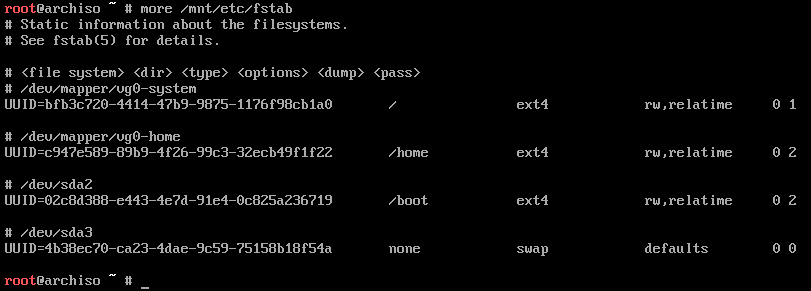
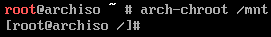

# Instalar el sistema

En este punto es necesario *montar* las particiones en carpetas para que el script de instalación pueda acceder a ellas. Es necesario montar tres particiones:

```bash
mount /dev/vg0/system /mnt
mkdir /mnt/home
mount /dev/vg0/home /mnt/home
mkdir /mnt/boot
mount /dev/sda2 /mnt/boot
```

La instalación de Arch Linux, firmwares necesarios y el kernel de Linux se realiza mediante `pacstrap`. En este punto es necesario decidir qué kernel se instalará:

* `linux`: última versión estable.
* `linux-hardened`: orientado a seguridad, incluye parches adicionales para evitar exploits.
* `linux-lts`: última versión LTS.
* `linux-zen`: última versión estable con parámetros de configuración reajustados para lograr un mayor rendimiento del kernel a cambio de un mayor consumo de potencia.

```bash
pacstrap /mnt base linux-zen linux-firmware nano
```

>El proceso de instalación es idéntico sin importar qué tipo de kernel se instale, con la salvedad del paquete [`virtualbox`](https://wiki.archlinux.org/index.php/VirtualBox#Installation_steps_for_Arch_Linux_hosts).

Una vez el proceso haya finalizado, es necesario persistir en el fichero `/etc/fstab` la información de las particiones que han de montarse automáticamente cuando arranque el sistema. El comando empleado usará las que haya montadas en ese momento:

```bash
genfstab -U /mnt >> /mnt/etc/fstab
```

El comando `more` permite mostrar el contenido del fichero recién creado. En este caso debería mostrar cuatro particiones: *Arranque*, *Swap* y las dos del *Sistema* (`/home` y `/`).



Para completar la configuración del sistema base, es necesario ejecutar el comando `arch-chroot /mnt` para poder acceder libremente a los archivos de instalación y modificarlos. El *prompt* del terminal cambiará a partir de ahora:



>El comando arch-chroot crea un **chroot-jail**, es decir, a partir de este momento no va a ser posible acceder a archivos fuera de la ruta absoluta `/mnt`, que es donde se han montado las particiones. Además, los comandos ejecutados creerán estar en la ruta `/`. Se trata de una práctica habitual cuando se realizan tareas de críticas en un sistema, como actualizarlo, recuperar contraseñas o repararlo.
