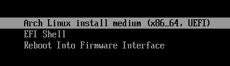

# Preparación y arranque del USB

Si el USB ha sido correctamente creado y la BIOS está bien configurada, al arrancar aparecerá un menú con opciones, entre ellas *Arch Linux install medium*. Tras seleccionar esa opción arrancará el sistema y nos mostrará un terminal sobre el que podremos configurar el disco e iniciar la instalación.



En este punto es conveniente cambiar la distribución del teclado a español:

```bash
loadkeys es
```

Antes de continuar es necesario disponer de conexión a Internet, para ello basta con hacer `ping` a cualquier URL válida y comprobar que responde:

```bash
ping -c3 archlinux.org
```
