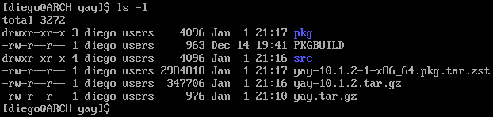
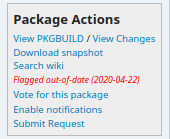
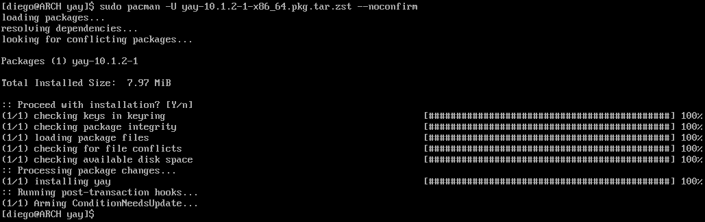
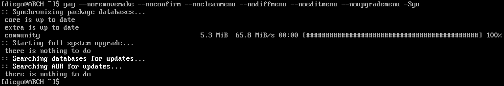

# YAY

En Arch Linux existe un repositorio desde el que se pueden obtener paquetes que son mantenidos por la comunidad de usuarios, conocido como AUR - [Arch User Repository](https://aur.archlinux.org/). A diferencia de los paquetes oficiales, estos requieren que el usuario descargue un `PKGBUILD` que ejecutará los pasos necesarios para generar el instalable que sí que se instala en el sistema con el comando `pacman`. Estos pasos incluyen, entre otros:

* Descarga de código fuente o binarios.
* Comprobación MD5 de los recursos descargados.
* Instalar dependencias necesarias.
* Compilar el código fuente descargado.
* Generar el instalable.

Una desventaja de este tipo de paquetes es que cuando se actualiza el sistema, no son tenidos en cuenta. Sin embargo, existe una herramienta llamada [`yay`](https://aur.archlinux.org/packages/yay) que permite automatizar su instalación y actualización, junto a los paquetes oficiales. Es decir, no es necesario usar `pacman` si se tiene instalado `yay`.

## Instalar `yay`

>Algunos de los comandos a emplear no permiten ser ejecutados como `root`, por lo que antes hay que iniciar sesión con otro usuario.

Instalar paquetes desde el AUR requiere descargar ciertos paquetes previamente:

```bash
sudo pacman -S fakeroot --noconfirm
```

>En este caso es necesario lanzar el comando mediante `sudo` al no estar trabajando como usuario `root`.

Inicialmente hay que crear una carpeta, descargar el `PKGBUILD` de `yay` y extraer el contenido:

```bash
mkdir yay
cd yay
curl https://aur.archlinux.org/cgit/aur.git/snapshot/yay.tar.gz --output yay.tar.gz
tar -xf yay.tar.gz --strip-components=1
```

El comando `makepkg` se encarga de generar el binario instalable:

```bash
makepkg -s
```

Tras finalizar, se habrá creado un fichero instalable mediante `pacman` en la ruta donde se ha ejecutado el comando anterior, de extensión `pkg.tar.zst`.



La estructura es idéntica a la de los paquetes oficiales, pero hay que tener en cuenta que al ser mantenidos por usuarios que no forman parte del equipo oficial de Arch Linux, es posible que en algún momento alguno de estos paquetes deje de ser actualizado hasta que otro usuario asuma su mantenimiento. Mientras eso ocurre, en la página del AUR correspondiente a ese paquete aparecerá como *out of date*.



>Aunque un paquete marcado como *out of date* puede aún ser instalado y funcionar, es recomendable buscar alternativas para garantizar la estabilidad del sistema.

Para instalar `yay`, se emplea `pacman` con el flag U:

```bash
sudo pacman -U yay-10.1.2-1-x86_64.pkg.tar.zst --noconfirm
```



Finalmente, se puede borrar la carpeta temporal que se ha empleado:

```bash
cd ..
rm -rf yay
```

## Gestionar paquetes con yay

Para instalar un paquete con `yay`, basta con localizarlo en la web del AUR y ejecutar el comando como si se tratara de `pacman`. Por ejemplo, para el paquete de Skype:

```bash
yay -S skypeforlinux-stable-bin
```

Para desinstalar un paquete se sigue empleado `pacman`:

```bash
sudo pacman -Rns skypeforlinux-stable-bin
```

>Los flags `n` y `s` le indican a `pacman` que borre los paquetes que haya habido que instalar como dependencias del que se está borrando, en caso de que no sean requeridos por ningún otro paquete que haya instalado. Son de uso opcional, pero permiten mantener el sistema más limpio.

## Actualización completa del sistema con yay

Dado que `yay` reemplaza y amplia el alcance de `pacman`, es posible usarlo para lanzar una actualización completa del sistema, incluyendo tanto paquetes oficiales como del AUR, de manera desatentida:

```bash
yay --noremovemake --noconfirm --nocleanmenu --nodiffmenu --noeditmenu --noupgrademenu -Syu
```


